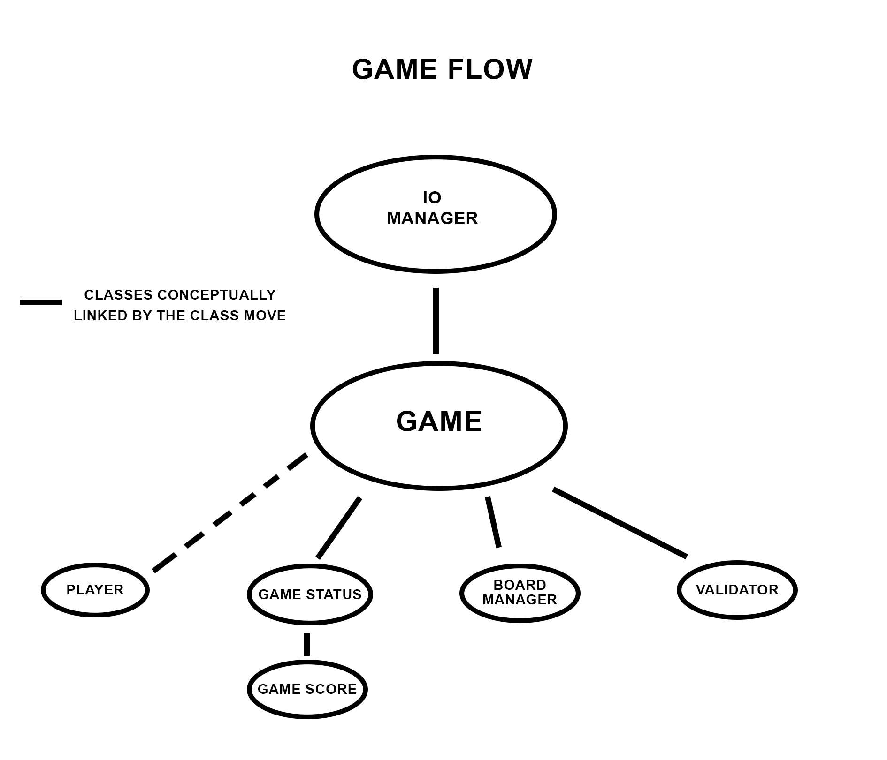

# Dots and Boxes
In this repository you can find our implementation of the classic game [dots and
boxes](https://en.wikipedia.org/wiki/Dots_and_Boxes).
We provide both a CLI and GUI for the game.

The project has been developed using [IntellJ IDEA](https://www.jetbrains.com/idea/)
with [Gradle](https://gradle.org/) and [TravisCI](https://travis-ci.org/getting_started).

In the [source directory](src/main/java) code is organized in packages as
follows:

* [iomanagement](src/main/java/iomanagement) contains the interfaces for classes
that manage input and output
* [gamesuite](src/main/java/gamesuite) contains the classes that model the game
dynamics
* [dotsandboxes](src/main/java/dotsandboxes) presents the actual implementations
of the game both, in particular, under [gui](src/main/java/dotsandboxes/gui) there
is the code for the graphical version of the game.

The classes in [gamesuite](src/main/java/gamesuite) and
[iomanagement](src/main/java/iomanagement) are linked logically as can be seen
in the figure below:

The tests for the above code can be found [here](src/test/java).
